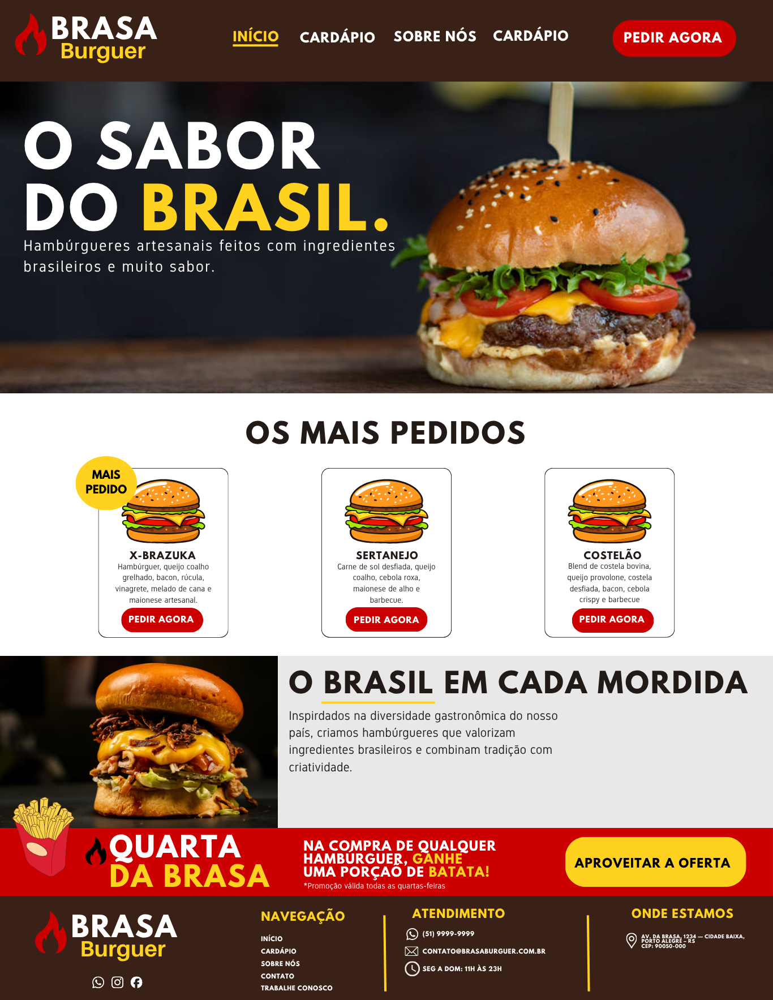

# 🍔 Brasa Burguer

Protótipo de site para uma hamburgueria brasileira

## 📚 Sobre o projeto

Projeto desenvolvido para a disciplina de Introdução à Programação Visual e Programação para intermet
do curso de Análise e Desenvolvimento de Sistemas.

O objetivo é criar o design de um site de hamburgueria utilizando
princípios de design e leis da Gestalt.

## 🛠️ Tecnologias

- HTML
- CSS
- JavaScript

## 🎨 Conceitos utilizados

- Lei da Proximidade
- Lei da Similaridade
- Lei da Continuidade
- Hierarquia visual
- Contraste
- Tipografia

## 📷 Prévia

## 📌 Status

🚧 Projeto acadêmico — em desenvolvimento.
